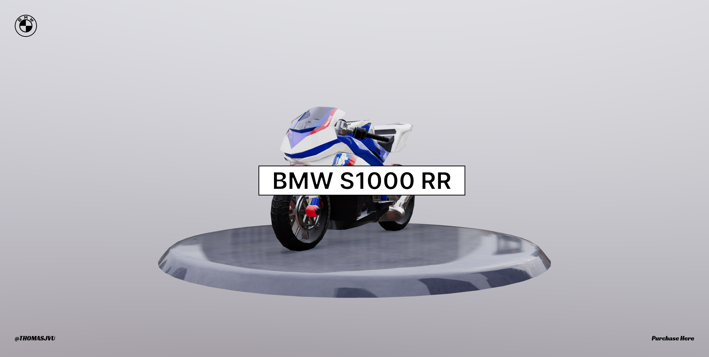

# BMW S1000RR Landing Page
This is a **concept** landing page design for the BMWS1000RR. It is made using React Three Fiber, which is a React renderer for Three.js made by [Poimandres](https://github.com/pmndrs).

## Technologies Used
- [x] React
- [x] React Three Fiber (Three.js)
- [x] Framer Motion

## Credits
All logos, images, and copyright are the intellectual property of BMW.
["BMW RR 1000"](https://skfb.ly/6DBVq) by lsalcedo is licensed under [Creative Commons Attribution](http://creativecommons.org/licenses/by/4.0/).
